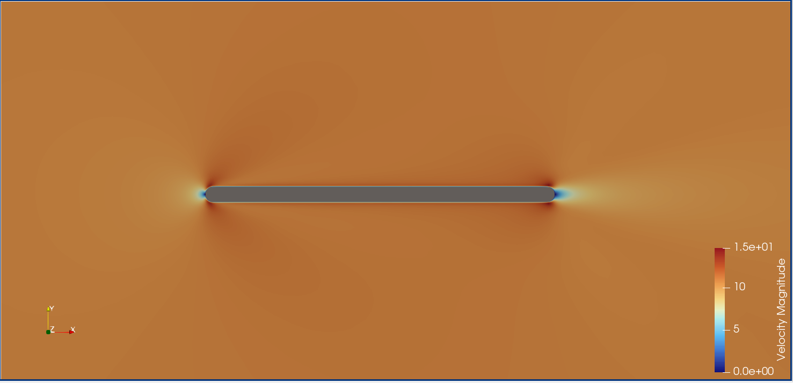
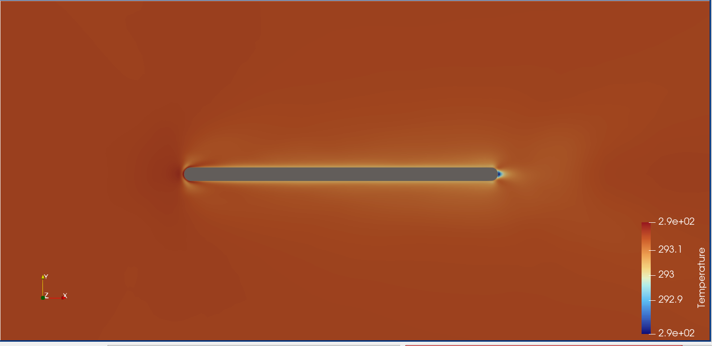

# Assignment 3 — Unsteady CHT Flat Plate via Python Wrapper

**GSoC 2026 | SU2 Physics-Informed Machine Learning**
**Author:** Abdulrahman Mahmoud | Cairo University
**SU2 Version:** 8.4.0 "Harrier"
**Reference test case:** [`TestCases/py_wrapper/flatPlate_unsteady_CHT`](https://github.com/su2code/SU2/blob/master/TestCases/py_wrapper/flatPlate_unsteady_CHT/launch_unsteady_CHT_FlatPlate.py)

---

## Overview

This assignment demonstrates the SU2 Python wrapper (`pysu2`) by running an **unsteady Conjugate Heat Transfer (CHT)** simulation over a 2D rounded flat plate at low Mach and low Reynolds numbers. The key feature is a **time-varying sinusoidal wall temperature** imposed programmatically at each time step through the wrapper, without modifying the SU2 source code. This exercises the core Python wrapper workflow: preprocessing, custom BC injection, solver execution, and output — all orchestrated from Python.

---

## Test Case Description

The problem models compressible viscous flow over a 2D rounded flat plate with a time-varying isothermal wall condition. The fluid is standard air modelled with the SST turbulence closure and Sutherland viscosity law. The simulation uses dual-time stepping to march the unsteady solution forward.

### Flow Conditions

| Parameter | Value |
|---|---|
| Solver | RANS + SST |
| Mach Number | 0.03059 |
| Freestream Velocity | ~10.5 m/s |
| Freestream Pressure | 101,325 Pa |
| Freestream Temperature | 293.15 K |
| Reynolds Number | 24,407 (Re length = 0.035 m) |
| Time Marching | Dual-time, 2nd order |
| Time Step | 0.003 s |
| Time Iterations | 10 |
| Inner Iterations (per step) | 10 |
| Mesh | `2D_Rounded_FlatPlate.su2` |

### Wall Temperature Boundary Condition

The wall temperature is prescribed at each time step by the Python wrapper as a homogeneous sinusoidal function of time:

$$T_{wall}(t) = 293 + 57 \cdot \sin(2\pi t)$$

This gives a temperature oscillation between **236 K and 350 K** over one cycle (period = 1 s). At the early time steps captured here (small $t$), the sine term is near zero, so the wall is close to the freestream temperature of 293 K — explaining the very narrow temperature variation visible in the results.

---

## Python Wrapper Workflow

The wrapper (`launch_unsteady_CHT_FlatPlate.py`) follows this sequence at each time step:

```
Preprocess(TimeIter)
  ↓
SetMarkerCustomTemperature(...)   ← inject sinusoidal T_wall for all plate vertices
  ↓
BoundaryConditionsUpdate()        ← push BCs into the solver
  ↓
Run()                             ← dual-time inner iterations
  ↓
Postprocess() → Update() → Monitor() → Output()
```

Key wrapper calls used:

| Call | Purpose |
|---|---|
| `CSinglezoneDriver(cfg, nZone, comm)` | Initialize solver and preprocessing |
| `GetCHTMarkerTags()` | Discover markers with CHT capability |
| `GetMarkerIndices()` | Map marker names to IDs on this MPI rank |
| `GetNumberMarkerNodes(id)` | Count vertices on the plate marker |
| `GetUnsteadyTimeStep()` | Retrieve Δt from the config |
| `SetMarkerCustomTemperature(id, iVert, T)` | Set per-vertex wall temperature |
| `BoundaryConditionsUpdate()` | Apply updated BCs before solver run |

---

## Repository Structure

```
Assignment3/
├── flatplate_unsteady_CHT.cfg          # SU2 configuration file
├── launch_unsteady_CHT_FlatPlate.py    # Python wrapper (unsteady CHT driver)
├── 2D_Rounded_FlatPlate.su2            # Mesh file
├── outputs/
│   ├── flow_*.vtu                      # Volume output per time step
│   └── history.csv                     # Convergence history
└── images/
    ├── velocity.png                    # Velocity magnitude field
    └── temperature.png                 # Temperature field
```

---

## How to Run

### Prerequisites

- SU2 v8.4.0 with Python bindings (`pysu2`)
- `mpi4py` (for parallel runs)

### Serial

```bash
python3 launch_unsteady_CHT_FlatPlate.py -f flatplate_unsteady_CHT.cfg
```

### Parallel (MPI)

```bash
mpirun -n 4 python3 launch_unsteady_CHT_FlatPlate.py -f flatplate_unsteady_CHT.cfg --parallel
```

---

## Results

### Velocity Field



The freestream velocity is ~10.5 m/s (orange), consistent with Mach 0.03059 at 293.15 K (speed of sound ≈ 343 m/s). Stagnation points are visible at both the **leading and trailing edges** of the rounded plate geometry (bright white, near-zero velocity), reflecting the symmetric blunt body shape. The no-slip boundary layer along the plate surface is thin but resolved — at Re ≈ 24,400 with a chord of 0.035 m the boundary layer is laminar in character. The flow field is largely undisturbed at this early time step, with no separation or wake instability, as expected for a well-resolved low-Re case.

### Temperature Field



The temperature field range is extremely narrow (~292.9–290.1 K), because these results correspond to the **first few time steps** where $t \approx 0$ and $\sin(2\pi t) \approx 0$, placing $T_{wall}$ close to the freestream value of 293.15 K. The faint warm halo visible around the plate perimeter confirms that the sinusoidal BC is active and being injected correctly by the wrapper — the wall is marginally warmer than the ambient at this phase of the oscillation. As the simulation advances through the full 10-second cycle, the temperature contrast will grow to ±57 K (ranging from 236 K to 350 K), producing a clearly visible oscillating thermal boundary layer. The slight cool spot at the trailing edge tip reflects local adiabatic expansion around the blunt geometry.

---

## Key Differences from Assignment 4

| Feature | Assignment 3 (this) | Assignment 4 |
|---|---|---|
| Solver | RANS SST | RANS SA |
| Time regime | Unsteady (dual-time) | Steady |
| Wall BC type | Homogeneous sinusoidal in time | Spatially varying linear ramp |
| Re | ~24,400 (low-speed CHT) | 5×10⁶ (high-speed turbulent) |
| Mach | 0.031 | 0.2 |
| Wrapper role | Per-step time update | Pre-run spatial setup |
| Turbulence | SST (k-ω) | Spalart-Allmaras |

---

## Notes

- `MARKER_PYTHON_CUSTOM = (plate)` in the config exposes the marker to the wrapper. Without this, `GetCHTMarkerTags()` would not return the plate.
- `MARKER_ISOTHERMAL = (plate, 293)` provides the fallback BC. It is **overridden every time step** by `SetMarkerCustomTemperature()` before `BoundaryConditionsUpdate()` is called.
- The `TIME_ITER= 10` setting runs only 10 time steps. Extending to `MAX_TIME= 1.0` with a smaller `TIME_STEP` would capture a full oscillation period and show the full ±57 K thermal cycle.
- `OUTPUT_WRT_FREQ= 3` writes volume output at iterations 0, 3, 6, 9 — providing 4 snapshots of the evolving temperature field.
