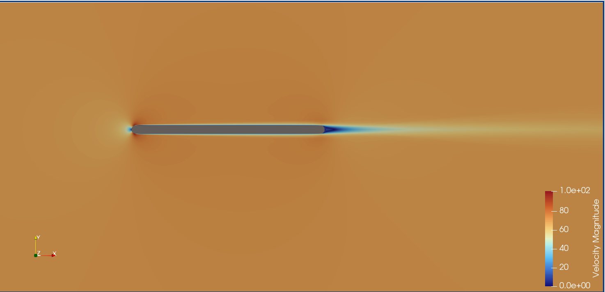
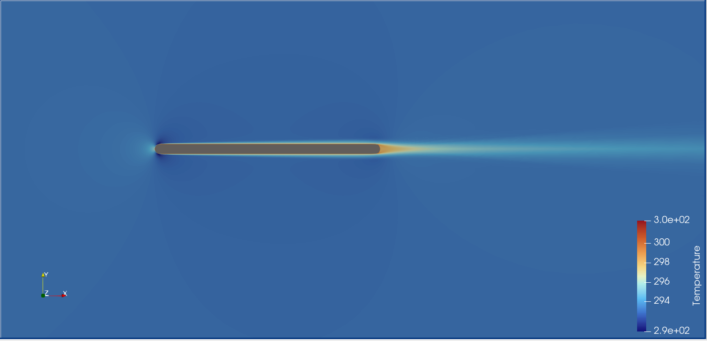

# Assignment 4 — Spatially Varying Wall Temperature via Python Wrapper

**GSoC 2026 | SU2 Physics-Informed Machine Learning**
**Solver:** SU2 v8.1.0 | **Turbulence Model:** Spalart-Allmaras (RANS)

---

## Overview

This assignment demonstrates the use of the SU2 Python wrapper (`pysu2`) to impose a **spatially varying isothermal wall boundary condition** on a steady-state compressible turbulent flat plate. Rather than a uniform wall temperature, the plate temperature increases linearly from the leading edge to the trailing edge, coupling the thermal and turbulent boundary layers in a physically richer configuration.

---

## Problem Setup

| Parameter | Value |
|---|---|
| Solver | RANS + Spalart-Allmaras |
| Mach Number | 0.2 |
| Angle of Attack | 0° |
| Freestream Pressure | 101,325 Pa |
| Freestream Temperature | 293.15 K |
| Reynolds Number | 5 × 10⁶ |
| Reynolds Length | 1.0 m |
| Wall Temperature (leading edge) | 300 K |
| Wall Temperature (trailing edge) | 500 K |
| Mesh | `mesh_flatplate.su2` |
| Max Iterations | 5000 |
| Convergence Target | RMS residual < 10⁻⁸ |

---

## Repository Structure

```
Assignment4/
├── turb_SA_flatplate.cfg       # SU2 configuration file
├── run_simulation.py           # Python wrapper (pysu2) with spatially varying T_wall
├── mesh_flatplate.su2          # Flat plate mesh
├── outputs/
│   └── flow.vtu                # Volume output for ParaView
└── images/
    ├── velocity.png             # Velocity field visualization
    └── temperature.png          # Temperature field visualization
```

---

## Spatially Varying Wall Temperature

The Python wrapper (`run_simulation.py`) uses `pysu2.CSinglezoneDriver` to intercept the solver before the run and apply a custom temperature profile to each vertex on the `plate` marker.

The temperature distribution follows a linear ramp:

$$T_{wall}(x) = 300 + 200 \cdot \frac{x}{L_{plate}}$$

where $L_{plate} = 0.01687$ m is the plate length. This gives:

- **Leading edge** ($x = 0$): $T_{wall} = 300$ K
- **Trailing edge** ($x = L$): $T_{wall} = 500$ K

The key wrapper logic:

```python
for i_vert in range(n_vertices):
    coords = driver.MarkerCoordinates(marker_id)
    x_coord = coords(i_vert, 0)
    normalized_x = np.clip(x_coord / plate_length, 0.0, 1.0)
    temperature = 300.0 + 200.0 * normalized_x
    driver.SetMarkerCustomTemperature(marker_id, i_vert, temperature)
```

---

## How to Run

### Prerequisites

- SU2 v8.1.0 with Python bindings (`pysu2`)
- `mpi4py`
- `numpy`

### Single process

```bash
python3 run_simulation.py
```

### MPI (parallel)

```bash
mpirun -n 4 python3 run_simulation.py
```

### Output

The solver writes volume output to `outputs/flow.vtu` every 500 iterations. 

---

## Results

### Velocity Field



The freestream velocity is ~68.6 m/s (orange), consistent with Mach 0.2 at 293.15 K (speed of sound ≈ 343 m/s). A clear stagnation point is visible at the leading edge where local velocity peaks near 100 m/s due to flow acceleration around the blunt leading geometry. The no-slip boundary condition is enforced along the entire plate surface (dark blue, zero velocity). The turbulent boundary layer is very thin relative to the domain size, as expected at Re = 5×10⁶. A clean, symmetric wake develops behind the trailing edge with no separation — physically correct for a zero-incidence flat plate.

### Temperature Field



The freestream temperature is 293.15 K (dark blue). A thin thermal boundary layer develops along the plate surface, with the heated wall visible as a warm orange/yellow band. The temperature plume convects downstream from the trailing edge, consistent with forced convection over a heated surface. The colormap is autoscaled by ParaView to the near-wall range (~293–300 K); rescaling to 293–500 K in ParaView will reveal the full spatial temperature gradient imposed by the linear ramp BC. The thermal boundary layer thickness is comparable to the velocity boundary layer, consistent with a turbulent Prandtl number of 0.90.

---

## Key Configuration Notes

- `MARKER_PYTHON_CUSTOM= ( plate )` — exposes the marker to the Python wrapper for custom BC injection.
- `MARKER_ISOTHERMAL= ( plate, 300.0 )` — sets a fallback uniform temperature; this is **overridden at runtime** by `SetMarkerCustomTemperature()` in the wrapper.
- `FLUID_MODEL= STANDARD_AIR` with Sutherland viscosity law accounts for temperature-dependent viscosity, which is physically important given the large wall temperature variation.
- `PRANDTL_TURB= 0.90` governs turbulent heat flux in the energy equation.

---

## Numerical Scheme Summary

| Setting | Value |
|---|---|
| Convective Flux | Roe scheme |
| Reconstruction | MUSCL with Venkatakrishnan limiter |
| Time Integration | Implicit Euler |
| Gradient Method | Weighted Least Squares |
| CFL Number | 5.0 |
