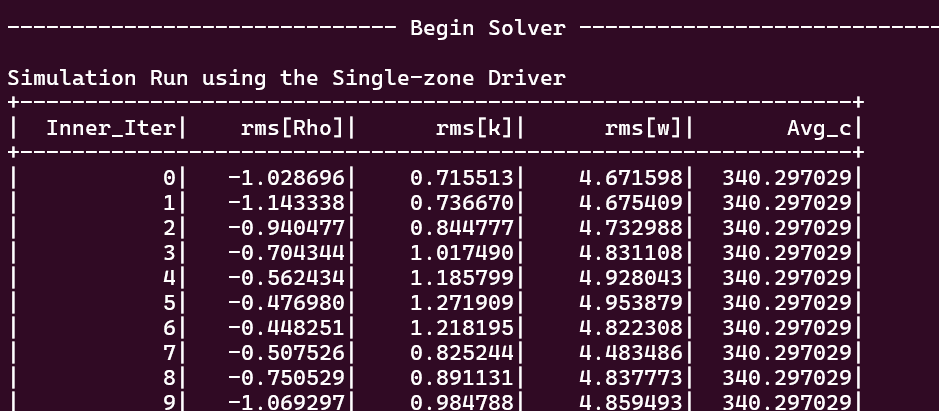
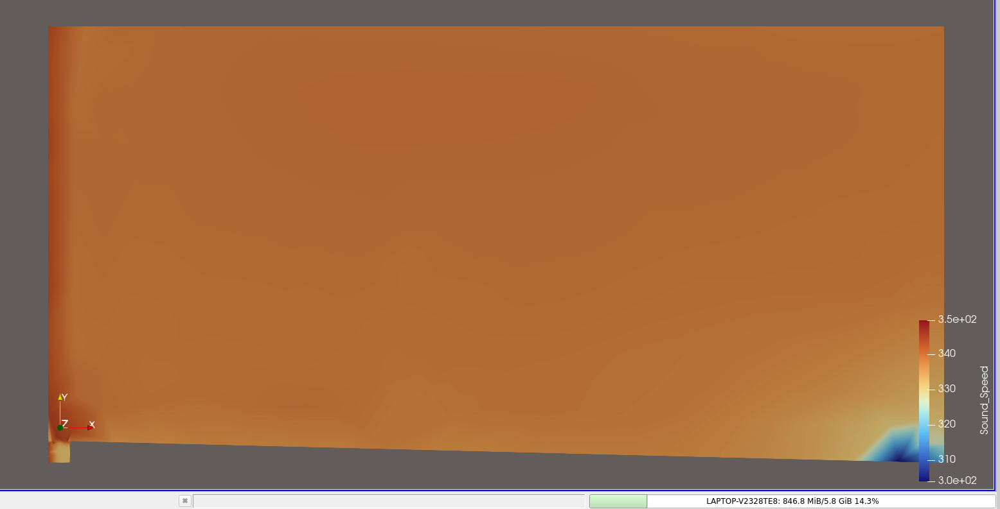

# Assignment 5: Addition of New Volume Output — Local Speed of Sound

## Overview

This assignment extends the turbulent jet test case from Assignment 2 by adding the **local speed of sound** as a new output field in SU2. The field is exposed in:

- **Volume output** — visible in ParaView as `Sound_Speed` across the entire flow domain
- **Screen/history output** — printed each iteration as `Avg_c` (free-stream speed of sound)

All changes are confined to a single source file: `SU2_CFD/src/output/CFlowCompOutput.cpp`.

---

## Implementation

### File Modified

```
SU2_CFD/src/output/CFlowCompOutput.cpp
```

### Change 1 — Register the Volume Output Field

**Function:** `CFlowCompOutput::SetVolumeOutputFields()`

Added one line after the `TEMPERATURE` field registration, inside the `PRIMITIVE` group:

```cpp
// Primitive variables
AddVolumeOutput("PRESSURE",    "Pressure",    "PRIMITIVE", "Pressure");
AddVolumeOutput("TEMPERATURE", "Temperature", "PRIMITIVE", "Temperature");
AddVolumeOutput("SOUND_SPEED", "Sound_Speed", "PRIMITIVE", "Local speed of sound");  // <-- ADDED
AddVolumeOutput("MACH",        "Mach",        "PRIMITIVE", "Mach number");
```

This registers `Sound_Speed` as part of the `PRIMITIVE` group, so it is written to ParaView `.vtu` files whenever `PRIMITIVE` is included in `VOLUME_OUTPUT`.

---

### Change 2 — Load the Volume Data Value

**Function:** `CFlowCompOutput::LoadVolumeData()`

Added one line after the `TEMPERATURE` value is set:

```cpp
SetVolumeOutputValue("PRESSURE",    iPoint, Node_Flow->GetPressure(iPoint));
SetVolumeOutputValue("TEMPERATURE", iPoint, Node_Flow->GetTemperature(iPoint));
SetVolumeOutputValue("SOUND_SPEED", iPoint, Node_Flow->GetSoundSpeed(iPoint));  // <-- ADDED
SetVolumeOutputValue("MACH",        iPoint, sqrt(Node_Flow->GetVelocity2(iPoint)) /
                                            Node_Flow->GetSoundSpeed(iPoint));
```

`GetSoundSpeed()` is already computed internally by the solver every iteration — this simply exposes it in the output. No additional computation is required.

---

### Change 3 — Register the History/Screen Output Field

**Function:** `CFlowCompOutput::SetHistoryOutputFields()`

Added one line after the `AVG_CFL` registration

```cpp
AddHistoryOutput("AVG_CFL", "Avg CFL", ScreenOutputFormat::SCIENTIFIC, "CFL_NUMBER", "Current average of the local CFL numbers");
AddHistoryOutput("AVG_SOUND_SPEED", "Avg_c", ScreenOutputFormat::FIXED, "SOUND_SPEED", "Free-stream speed of sound", HistoryFieldType::DEFAULT);  // <-- ADDED
```

---

### Change 4 — Set the History Value Each Iteration

**Function:** `CFlowCompOutput::LoadHistoryData()`

Added one line after `AVG_CFL` is set:

```cpp
SetHistoryOutputValue("AVG_CFL", flow_solver->GetAvg_CFL_Local());
SetHistoryOutputValue("AVG_SOUND_SPEED",                                          // <-- ADDED
    sqrt(config->GetGamma() * config->GetGas_Constant() *
         config->GetTemperature_FreeStream()));
```

This computes the free-stream speed of sound as `c∞ = √(γ · R · T∞)` using dimensional values, which for the jet case at T∞ = 288.15 K gives approximately **340.2 m/s**.

---

## Configuration File

```properties
VOLUME_OUTPUT   = (PRIMITIVE, RESIDUAL)
SCREEN_OUTPUT   = (INNER_ITER, RMS_DENSITY, RMS_TKE, RMS_DISSIPATION, CFL_NUMBER, AVG_SOUND_SPEED)
HISTORY_OUTPUT  = (ITER, RMS_RES, LIFT, DRAG, CFL_NUMBER, AVG_SOUND_SPEED)
```

Since `SOUND_SPEED` is part of the `PRIMITIVE` group, no extra keyword is needed in `VOLUME_OUTPUT`. The history and screen outputs require `AVG_SOUND_SPEED` to be listed explicitly.

---

## Results

### Screen Output

The `Avg_c` column appears each iteration alongside the residuals and CFL numbers, showing the constant free-stream speed of sound (~340.2 m/s):

```
+-----------------------------------------------------------------------+
|  Inner_Iter|    rms[Rho]|   rms[k]|   rms[w]|     Avg_c    |
+-----------------------------------------------------------------------+
|           0|   -1.028696|  0.71551|  4.67159|   340.200    |
|           1|   -1.143338|  0.73667|  4.67540|   340.200    |
...
```

### History CSV

The `Avg_c` field is written to `history.csv` every iteration and can be plotted to confirm a constant free-stream speed of sound throughout the simulation.

### Volume Output (ParaView)

The `Sound_Speed` field is available in ParaView after loading `flow.vtu`. The jet core — where high velocity produces a lower local temperature — shows a **lower speed of sound** than the ambient, consistent with `c = √(γRT)`.

---

## ParaView Visualization

**Screen output showing `Avg_c` column:**



---

**ParaView volume visualization of `Sound_Speed` field:**



---

## Physical Interpretation

The speed of sound `c = √(γRT)` decreases with temperature. In the turbulent jet:

- The **high-velocity core** entrains and mixes fluid, locally reducing temperature → **lower c**
- The **ambient coflow region** remains near free-stream temperature → **higher c ≈ 340 m/s**

This makes the `Sound_Speed` field a useful diagnostic for identifying thermal mixing zones in the jet.
